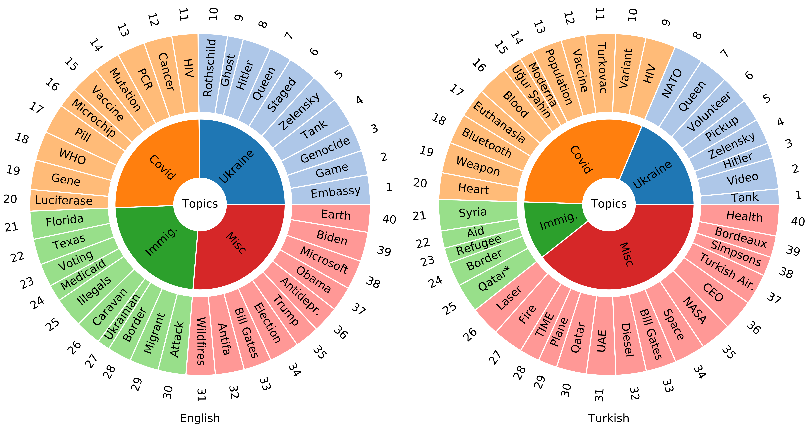

#MiDe-22 Dataset

The dataset and related files will be published here soon. We are processing an internal permission process for publishing the data contents online.



# Dataset
The dataset is composed of 10,348 tweets: 5,284 for English and 5,064 for Turkish. Tweets in the dataset cover different topics: the Russia-Ukraine war, COVID-19 pandemic, Refugees, and additional miscellaneous events. Three misinformation label of the tweet are also given. Since we follow Twitter's Terms and Conditions, we publish tweet IDs not the tweet content directly. Explanations of the columns of the file are as follows:

| Column Name  | Description |
| ------------- | ------------- |
| Topic | Topic of the tweet: Ukraine, Covid, Refugees or Misc |
| Event | Event of the tweet: EN01-EN40 in English and TR01-TR40 in Turkish |
| Label | Label of the tweet: True, False, or Other|
| Tweet_id | Twitter ID of the tweet|

Distribution of tweets in the dataset is as follows:

| Lang | Topic | True | False | Other | Total |
|----------|----------|----------|----------|----------|----------|
| EN | Ukraine<br>Covid<br>Refugees<br>Misc<br><b>Total</b> | 320<br>167<br>94<br>146<br><b>727</b> | 393<br>514<br>328<br>494<br><b>1,729 | 618<br>663<br>796<br>751<br><b>2,828 | 1,331<br>1,344<br>1,218<br>1,391<br><b>5,284
| TR | Ukraine<br>Covid<br>Refugees<br>Misc<br><b>Total</b> | 129<br>190<br>61<br>289<br><b>669 | 338<br>558<br>202<br>634<br><b>1,732 | 477<br>816<br>298<br>1,072<br><b>2,663 | 944<br>1,564<br>561<br>1,995<br><b>5,064


# Citation
If you make use of this dataset, please cite following paper.

```bibtex
@misc{toraman2022good,
      title={Not Good Times for Lies: Misinformation Detection on the Russia-Ukraine War, COVID-19, and Refugees},
      author={Cagri Toraman and Oguzhan Ozcelik and Furkan Şahinuç and Fazli Can},
      year={2022},
      eprint={2210.05401},
      archivePrefix={arXiv},
      primaryClass={cs.SI}
}
```
